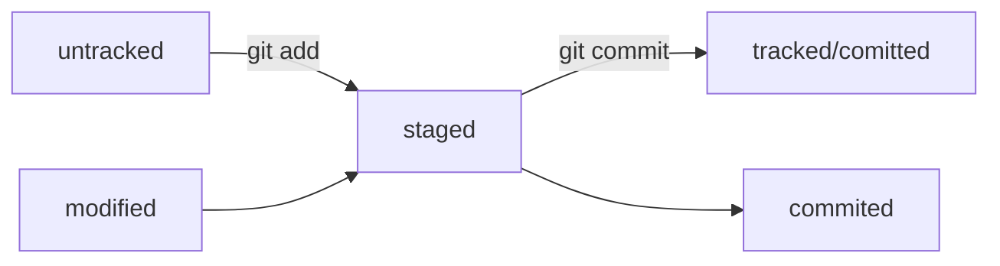

### Тестовый репозиторий - выполнение Практической работы 1 и 2 
##### Создан в результате выполения практической работы 1 и на яндекс практикуме по Git   

В репозитории лежат 3 файла (помимо README.md):   
1. Файл с кратким списком как делать комиты и пушить их на гитхаб
2. Файл с кратким описанием как привязать репозиторий гитхаба к локальному репозиторию
3. Файл с основной информацией из уроков о хеше, логе, HEAD, статусах файлов и оформлении сообщений к коммитам

####Схема изменения статусов:  
modified + git add = staged

